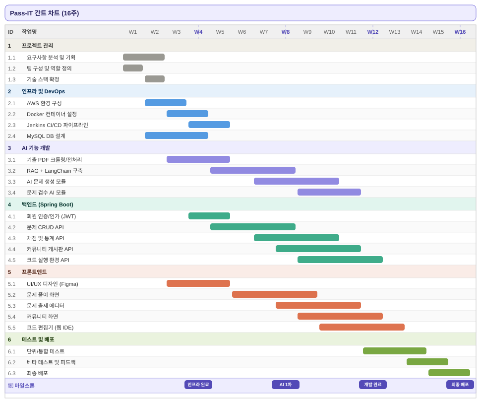
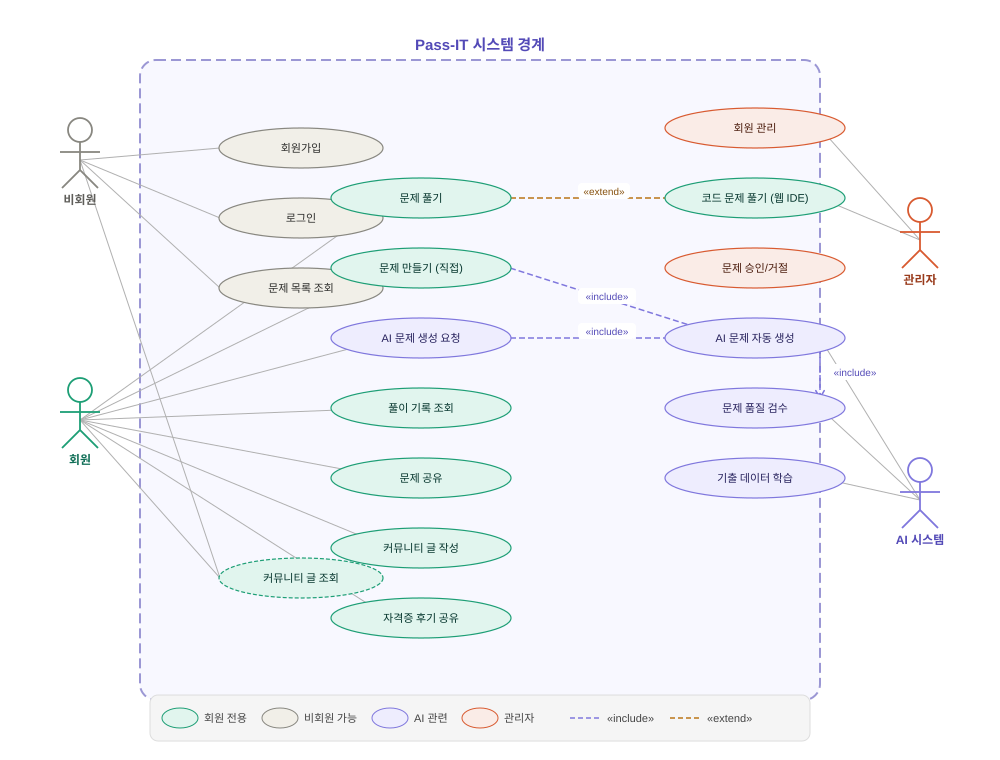
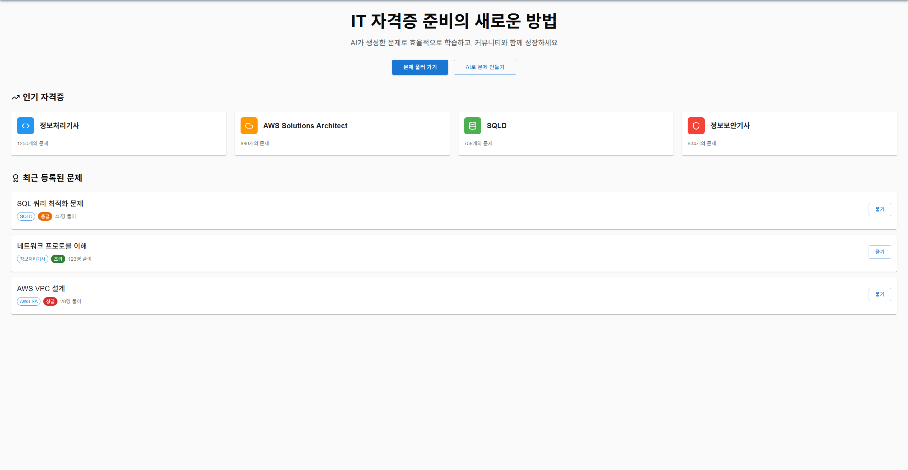
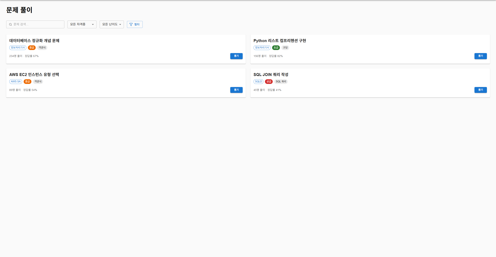
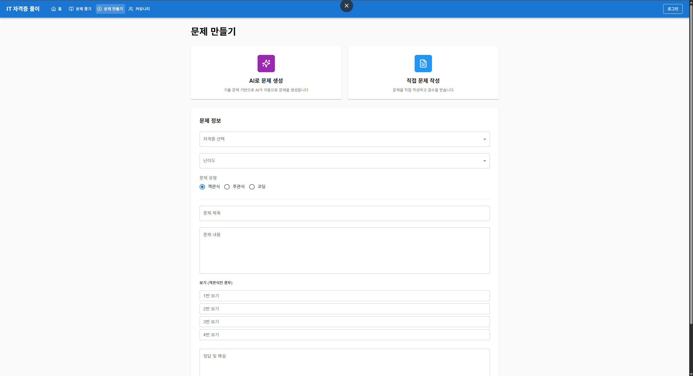
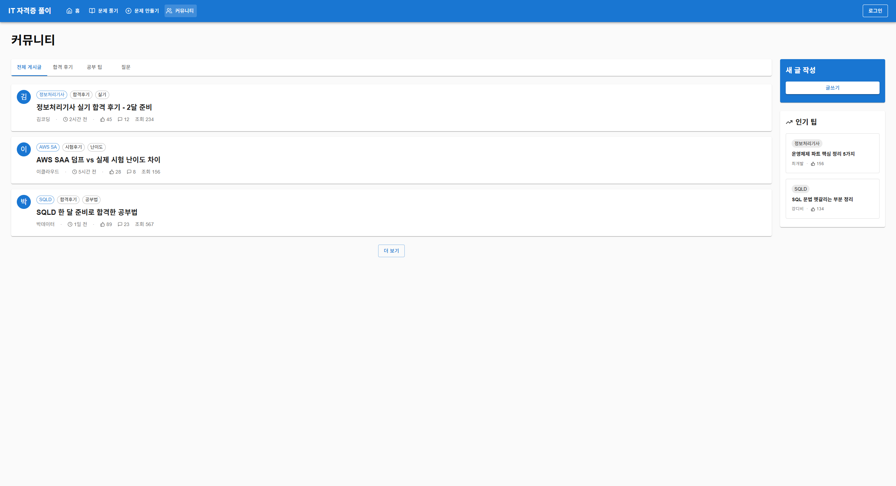

# Pass-IT 🎯

> IT 자격증 문제 풀이 플랫폼

---

## 📌 프로젝트 개요

**Pass-IT**은 IT 자격증 취득을 준비하는 사람들을 위한 문제 풀이 플랫폼입니다.
AI 기반 문제 생성, 사용자 직접 출제, 커뮤니티 기능, 웹 기반 코드 실행 환경을 통해
자격증 학습의 전 과정을 지원합니다.

---

## 💡 주요 기능

- **AI 문제 생성** — 기출 문제 PDF를 학습한 AI가 새로운 문제를 자동 생성하고 품질을 검수
- **직접 출제** — 사용자가 직접 문제를 만들어 공유하거나, 다른 사람이 만든 문제를 풀 수 있음
- **커뮤니티** — 자격증별 후기, 팁, 정보 공유 게시판
- **웹 IDE** — 프로그래밍 언어 관련 문제를 브라우저에서 바로 풀 수 있는 코드 실행 환경

---

## 🛠 기술 스택

| 분류 | 기술 |
|------|------|
| 프론트엔드 | 미정 |
| 백엔드 | Java, Spring Boot, Spring Data JPA |
| 데이터베이스 | MySQL |
| CI/CD | Jenkins |
| 배포 | Docker, AWS |
| 인공지능 | RAG (검색 증강 생성), LangChain |
| 협업 | Jira, Confluence, Figma |

---

## 📋 WBS (작업 분류 체계)

---

## 📊 간트 차트 (16주 일정)

---

## 🔷 유스케이스 다이어그램

### 액터 설명

| 액터 | 설명 |
|------|------|
| 비회원 | 회원가입 없이 문제 목록 조회 및 커뮤니티 열람 가능 |
| 회원 | 문제 풀기, 출제, AI 생성 요청, 커뮤니티 활동 가능 |
| 관리자 | 문제 승인/거절, 회원 관리 등 플랫폼 운영 담당 |
| AI 시스템 | 기출 데이터 학습 기반으로 문제 자동 생성 및 검수 수행 |

---

## 🗓 마일스톤

| 주차 | 마일스톤 | 내용 |
|------|----------|------|
| W4 | 인프라 완료 | AWS, Docker, Jenkins, DB 설계 완료 |
| W8 | AI 1차 완료 | RAG 파이프라인 및 데이터 전처리 완료 |
| W12 | 개발 완료 | 백엔드·프론트엔드·AI 주요 기능 개발 완료 |
| W16 | 최종 배포 | 베타 테스트 반영 후 운영 환경 배포 |

---

## 📁 협업 도구

- **Jira** — 스프린트 및 이슈 관리
- **Confluence** — 문서화 및 회의록
- **Figma** — UI/UX 디자인 협업

---

## 화면 설계

### 메인 화면

### 문제 조회 화면

### 문제 생성 화면

### 커뮤니티 화면
    